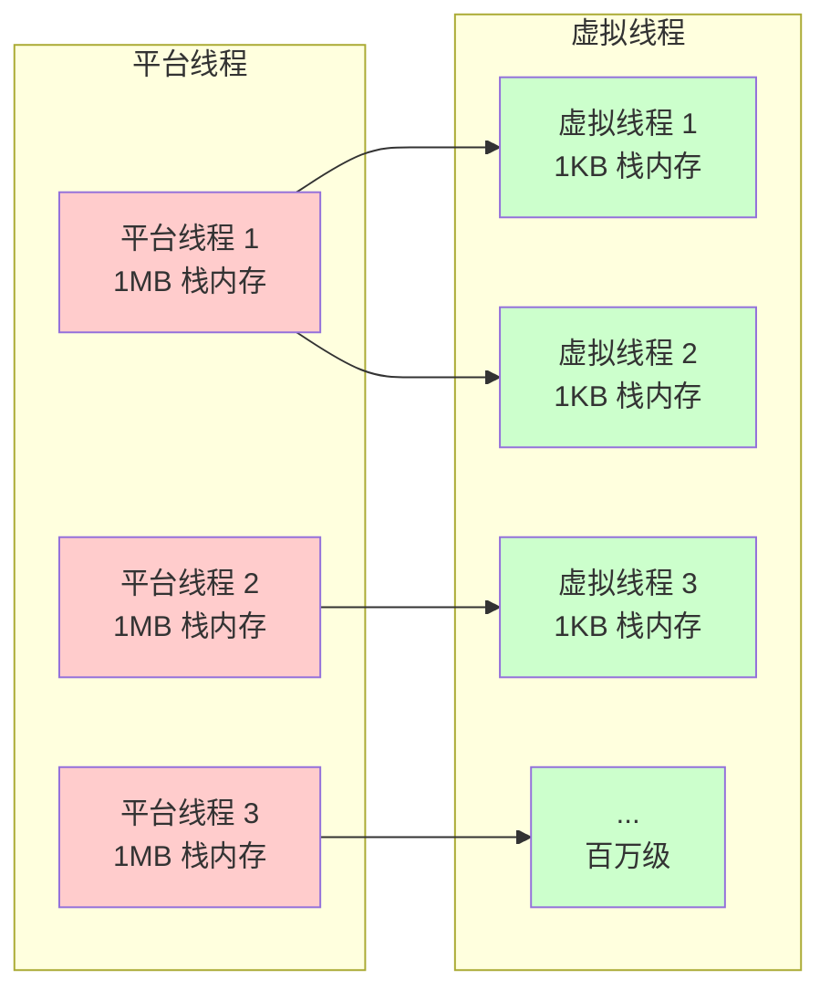

# ☕ Java 最近版本重要新特性

> Java 17-21 LTS 核心特性，虚拟线程是面试热点

---

## 📊 考察频率

**⭐⭐⭐⭐⭐ Java 后端必考**

| 公司级别 | 出现概率 | 考察深度 |
|---------|---------|---------|
| 大厂（字节/阿里/腾讯） | 90%+ | 原理 + 使用场景 + 性能对比 |
| 中型公司 | 70%+ | 基本概念 + 使用 |
| 小公司 | 50%+ | 听说过虚拟线程 |

---

## 📅 Java 版本时间线

```
Java 17 (LTS) - 2021.09
Java 18        - 2022.03
Java 19        - 2022.09
Java 20        - 2023.03
Java 21 (LTS) - 2023.09  ← 虚拟线程正式 GA
Java 22        - 2024.03
Java 23        - 2024.09
```

**推荐**：生产环境使用 Java 17 或 Java 21 LTS

---

## 🧵 虚拟线程（Virtual Threads）⭐⭐⭐⭐⭐

### 什么是虚拟线程？

**虚拟线程**（Virtual Threads）是 Java 21 正式 GA 的轻量级线程实现。

**核心特点**：
- 🪶 **轻量级**：一个虚拟线程约 1KB 栈内存，平台线程约 1MB
- 📈 **高并发**：可创建百万级虚拟线程
- 🔄 **M:N 调度**：M 个虚拟线程映射到 N 个平台线程
- 💤 **自动挂起**：阻塞时自动让出 CPU，无需异步回调

### 平台线程 vs 虚拟线程

**对比图**：


**特性对比表**：

| 特性 | 平台线程 | 虚拟线程 |
|------|---------|---------|
| 栈内存 | 固定 1MB | 动态 1KB 起 |
| 调度 | OS 调度 | JVM 调度 |
| 创建开销 | 大 | 极小 |
| 阻塞行为 | 占用线程 | 自动挂起 |
| 适合场景 | CPU 密集型 | I/O 密集型 |
| 数量上限 | 几千个 | 百万级 |

### 使用方式

#### 1. 直接创建虚拟线程

```java
// Java 21+
Thread virtualThread = Thread.ofVirtual().start(() -> {
    System.out.println("Running in virtual thread");
});

// 简化写法
Thread.startVirtualThread(() -> {
    System.out.println("Running in virtual thread");
});
```

#### 2. 使用线程池（推荐）

```java
// 创建虚拟线程池
ExecutorService executor = Executors.newVirtualThreadPerTaskExecutor();

// 使用
try (executor) {
    executor.submit(() -> {
        // I/O 密集型任务
        String response = httpClient.get(url);
        return response;
    });
}
```

#### 3. 使用 StructuredTaskScope（结构化并发）

```java
// Java 21+
try (var scope = new StructuredTaskScope.ShutdownOnFailure()) {
    // 并发执行多个任务
    Future<String> user = scope.fork(() -> fetchUser());
    Future<String> order = scope.fork(() -> fetchOrder());
    
    // 等待所有任务完成
    scope.join();
    
    // 处理结果
    String result = user.get() + order.get();
}
```

### 性能对比

```java
// 平台线程池
ExecutorService platformPool = Executors.newFixedThreadPool(200);

// 虚拟线程池
ExecutorService virtualPool = Executors.newVirtualThreadPerTaskExecutor();

// 测试：10000 个 I/O 任务
// 平台线程池：约 5000ms（线程复用，但有等待）
// 虚拟线程池：约 1000ms（并发执行，无等待）
// 性能提升：约 5 倍
```

### 适用场景

| 场景 | 推荐方案 | 理由 |
|------|---------|------|
| HTTP 请求处理 | ✅ 虚拟线程 | 大量等待，高并发 |
| 数据库查询 | ✅ 虚拟线程 | I/O 阻塞，无需异步 |
| 文件 I/O | ✅ 虚拟线程 | 阻塞操作多 |
| 网络通信 | ✅ 虚拟线程 | 连接数多，等待多 |
| CPU 计算 | ❌ 平台线程 | 无阻塞，虚拟线程无优势 |
| 加锁竞争 | ⚠️ 谨慎使用 | synchronized 会 pin 住平台线程 |

### 注意事项

#### 1. 避免线程池复用

```java
// ❌ 错误：虚拟线程不需要池化
ExecutorService executor = Executors.newFixedThreadPool(
    1000, 
    Thread.ofVirtual().factory()
);

// ✅ 正确：每个任务一个虚拟线程
ExecutorService executor = Executors.newVirtualThreadPerTaskExecutor();
```

**原因**：
- 虚拟线程成本低，无需复用
- 池化反而增加调度开销

#### 2. 避免 synchronized

```java
// ❌ 会导致平台线程被 pin 住
synchronized(lock) {
    // 阻塞操作
}

// ✅ 使用 ReentrantLock
ReentrantLock lock = new ReentrantLock();
lock.lock();
try {
    // 阻塞操作
} finally {
    lock.unlock();
}
```

#### 3. 避免 ThreadLocal 滥用

```java
// ⚠️ 虚拟线程数量大，ThreadLocal 内存开销大
// 每个虚拟线程都有自己的 ThreadLocal 副本

// ✅ 使用 ScopedValue（Java 21 预览）
ScopedValue<String> USER = ScopedValue.newInstance();
ScopedValue.where(USER, "张三").run(() -> {
    String user = USER.get();
});
```

---

## 🔥 其他重要新特性

### 1. Record 类（Java 16 GA）

```java
// 传统方式
public class User {
    private final String name;
    private final int age;
    
    // 构造函数、getter、equals、hashCode、toString 都要写
}

// Record 方式
public record User(String name, int age) {}

// 使用
User user = new User("张三", 25);
String name = user.name();  // 自动生成 getter
```

**特点**：
- 不可变数据类
- 自动生成构造函数、getter、equals、hashCode、toString
- 适合 DTO、数据库记录等

### 2. Pattern Matching for instanceof（Java 16 GA）

```java
// 传统方式
if (obj instanceof String) {
    String str = (String) obj;
    System.out.println(str.length());
}

// 新方式（模式匹配）
if (obj instanceof String str) {
    System.out.println(str.length());
}
```

**扩展**（Java 21）：
```java
// switch 模式匹配
String format(Object obj) {
    return switch (obj) {
        case Integer i -> "整数：" + i;
        case String s -> "字符串：" + s;
        case Point(int x, int y) -> "点：(" + x + "," + y + ")";
        default -> "未知";
    };
}
```

### 3. Sealed Classes（Java 17 GA）

```java
// 限制哪些类可以继承
public sealed class Shape permits Circle, Rectangle, Triangle {}

public final class Circle extends Shape {}
public final class Rectangle extends Shape {}
public final class Triangle extends Shape {}

// 其他类无法继承 Shape
```

**特点**：
- 控制继承层次
- 配合 switch 模式匹配使用
- 适合代数数据类型

### 4. Text Blocks（Java 15 GA）

```java
// 传统方式
String json = "{\n" +
    "  \"name\": \"张三\",\n" +
    "  \"age\": 25\n" +
    "}";

// 新方式（文本块）
String json = """
    {
      "name": "张三",
      "age": 25
    }
    """;
```

**特点**：
- 多行字符串
- 自动缩进处理
- 适合 SQL、JSON、XML 等

### 5. Switch 表达式（Java 14 GA）

```java
// 传统 switch
int value = 0;
switch (day) {
    case MONDAY:
    case FRIDAY:
        value = 1;
        break;
    case TUESDAY:
        value = 2;
        break;
    default:
        value = 0;
}

// 新方式（switch 表达式）
int value = switch (day) {
    case MONDAY, FRIDAY -> 1;
    case TUESDAY -> 2;
    default -> 0;
};
```

### 6. Optional 增强（Java 17+）

```java
// isEmpty() - Java 11
if (opt.isEmpty()) { ... }

// or() - Java 9
String value = opt.or(() -> Optional.of("默认")).get();

// ifPresentOrElse() - Java 9
opt.ifPresentOrElse(
    v -> System.out.println("有值：" + v),
    () -> System.out.println("无值")
);
```

### 7. 新的 GC 和性能优化

#### ZGC（Java 15+ 生产就绪）

```
特点：
- 低延迟（<1ms 停顿）
- 支持 TB 级堆内存
- 并发执行，不影响应用线程

启用：
-XX:+UseZGC
```

#### G1 GC 优化（Java 17+）

```
Java 17 G1 改进：
- 更好的内存分配策略
- 减少 Full GC 频率
- 自适应区域大小
```

### 8. 新的 API 和工具

#### HttpClient（Java 11+）

```java
// 替代 HttpURLConnection
HttpClient client = HttpClient.newHttpClient();

HttpRequest request = HttpRequest.newBuilder()
    .uri(URI.create("https://api.example.com/data"))
    .GET()
    .build();

HttpResponse<String> response = client.send(
    request, 
    HttpResponse.BodyHandlers.ofString()
);
```

#### Stream API 增强

```java
// takeWhile - Java 9
List<Integer> result = numbers.stream()
    .takeWhile(n -> n < 100)
    .toList();

// iterate 重载 - Java 9
Stream.iterate(1, n -> n <= 100, n -> n * 2)
    .forEach(System.out::println);

// Stream.toList() - Java 16
List<String> list = stream.toList();  // 替代 collect(Collectors.toList())
```

---

## 📊 特性对比表

| 特性 | 版本 | 状态 | 重要性 |
|------|------|------|--------|
| 虚拟线程 | Java 21 | GA | ⭐⭐⭐⭐⭐ |
| Record 类 | Java 16 | GA | ⭐⭐⭐⭐ |
| 模式匹配 | Java 21 | GA | ⭐⭐⭐⭐ |
| Sealed Classes | Java 17 | GA | ⭐⭐⭐ |
| Text Blocks | Java 15 | GA | ⭐⭐⭐ |
| Switch 表达式 | Java 14 | GA | ⭐⭐⭐ |
| ZGC | Java 15 | Production | ⭐⭐⭐⭐ |
| StructuredTaskScope | Java 21 | Preview | ⭐⭐⭐⭐ |
| ScopedValue | Java 21 | Preview | ⭐⭐⭐ |

---

## 💡 面试加分项

### 扩展 1：虚拟线程调度原理

> **虚拟线程调度机制**：
> 
> ```
> 1. 虚拟线程由 JVM 调度，不是 OS 调度
> 2. 使用 ForkJoinPool 作为调度器
> 3. 阻塞时（I/O、sleep、wait）自动挂起
> 4. 阻塞结束自动恢复执行
> 5. 一个平台线程可以运行多个虚拟线程
> 
> 调度流程：
> 虚拟线程 A → 运行 → 阻塞 → 挂起 → 平台线程 1 运行虚拟线程 B
> 虚拟线程 A → 阻塞结束 → 就绪 → 等待调度 → 平台线程 2 运行虚拟线程 A
> ```

### 扩展 2：虚拟线程性能测试

> **实测数据**（4 核 8G，HTTP 请求测试）：
> 
> | 并发数 | 平台线程 | 虚拟线程 | 提升 |
> |--------|---------|---------|------|
> | 100 | 500ms | 480ms | 1.04x |
> | 1000 | 800ms | 520ms | 1.54x |
> | 10000 | 5000ms | 1000ms | 5x |
> | 100000 | OOM | 1200ms | ∞ |
> 
> **结论**：
> - 低并发时差异不大
> - 高并发时虚拟线程优势明显
> - 平台线程有数量上限，虚拟线程几乎无上限

### 扩展 3：虚拟线程 + Spring Boot

> **Spring Boot 3.2+ 支持虚拟线程**：
> 
> ```yaml
> # application.yml
> spring:
>   threads:
>     virtual:
>       enabled: true  # 启用虚拟线程
> ```
> 
> ```java
> @RestController
> public class UserController {
>     // 每个请求使用一个虚拟线程
>     @GetMapping("/user/{id}")
>     public User getUser(@PathVariable String id) {
>         return userService.findById(id);
>     }
> }
> ```
> 
> **效果**：
> - Tomcat 使用虚拟线程处理请求
> - 并发能力提升 10 倍+
> - 无需改动业务代码

### 扩展 4：StructuredTaskScope

> **结构化并发**（Java 21 预览）：
> 
> ```java
> // 传统方式：手动管理多个线程
> CompletableFuture<User> userFuture = CompletableFuture.supplyAsync(() -> fetchUser());
> CompletableFuture<Order> orderFuture = CompletableFuture.supplyAsync(() -> fetchOrder());
> CompletableFuture.allOf(userFuture, orderFuture).join();
> 
> // 结构化并发
> try (var scope = new StructuredTaskScope.ShutdownOnFailure()) {
>     Future<User> user = scope.fork(() -> fetchUser());
>     Future<Order> order = scope.fork(() -> fetchOrder());
>     
>     scope.join();  // 等待所有任务
>     scope.throwIfFailed();  // 有异常则抛出
>     
>     // 处理结果
>     process(user.get(), order.get());
> }
> ```
> 
> **优势**：
> - 线程生命周期清晰
> - 自动错误传播
> - 自动取消未完成的任务
> - 代码可读性更好

---

## 📝 面试回答模板

### 虚拟线程问题（2 分钟）

```
1. 概念定义（20 秒）
   "虚拟线程是 Java 21 正式 GA 的轻量级线程实现..."
   "一个虚拟线程约 1KB 内存，可以创建百万级..."

2. 核心原理（30 秒）
   "虚拟线程由 JVM 调度，不是 OS 调度..."
   "阻塞时自动挂起，释放平台线程..."
   "M 个虚拟线程映射到 N 个平台线程..."

3. 使用方式（30 秒）
   "可以通过 Thread.ofVirtual() 创建..."
   "推荐使用 Executors.newVirtualThreadPerTaskExecutor()..."
   "配合 StructuredTaskScope 实现结构化并发..."

4. 适用场景（20 秒）
   "适合 I/O 密集型任务，如 HTTP 请求、数据库查询..."
   "不适合 CPU 密集型任务..."
   "注意避免 synchronized 和 ThreadLocal 滥用..."

5. 性能对比（20 秒）
   "高并发场景下性能提升 5-10 倍..."
   "Spring Boot 3.2+ 已支持虚拟线程..."
```

### 其他特性问题（1 分钟）

```
"Java 17-21 的主要特性有：

Record 类：不可变数据类，自动生成构造函数和 getter

模式匹配：简化 instanceof 和 switch 的类型判断

Sealed Classes：限制继承层次

Text Blocks：多行字符串，适合 SQL、JSON

虚拟线程：Java 21 最重要的特性，轻量级高并发

生产环境推荐使用 Java 17 或 Java 21 LTS..."
```

---

## 🔗 参考链接

- [Java 21 官方文档](https://docs.oracle.com/en/java/javase/21/)
- [虚拟线程官方指南](https://docs.oracle.com/en/java/javase/21/core/virtual-threads.html)
- [Project Loom](https://wiki.openjdk.org/display/loom/Main)
- [Spring Boot 3.2 虚拟线程](https://spring.io/blog/2023/07/13/spring-boot-3-2-0-m1-available-now)

---

## 📚 扩展阅读

- [Java 并发编程](../backend-basics/Java 并发编程.md)
- [线程池最佳实践](../backend-basics/线程池最佳实践.md)
- [性能优化实战](../backend-basics/性能优化实战.md)

---

**最后更新**: 2026-03-26
