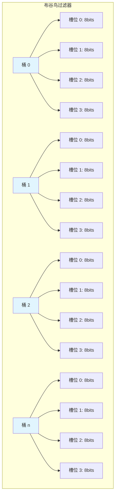
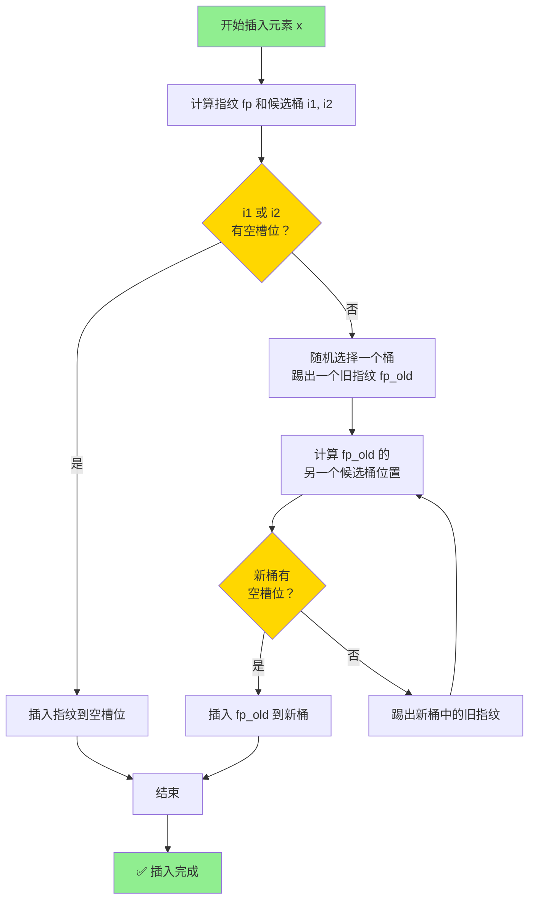
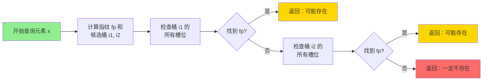
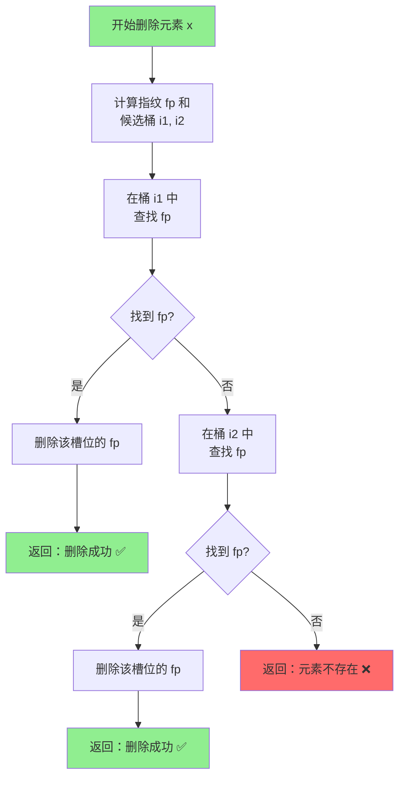

# 🐦 布谷鸟过滤器（Cuckoo Filter）

> 布隆过滤器的改进版，支持删除 + 更高空间效率

---

## 📊 考察频率

**⭐⭐⭐⭐ 进阶考点**

| 公司级别 | 出现概率 | 考察深度 |
|---------|---------|---------|
| 大厂（字节/阿里/腾讯） | 70%+ | 原理 + 与布隆对比 + 场景选型 |
| 中型公司 | 40%+ | 概念理解 + 优势 |
| 小公司 | 20%+ | 听说过即可 |

---

## 🎯 什么是布谷鸟过滤器？

**布谷鸟过滤器**（Cuckoo Filter）是 2014 年提出的一种概率型数据结构，是布隆过滤器的改进版本。

**核心改进**：
- ✅ **支持删除操作**
- ✅ **空间效率更高**（约 4 bits/元素 vs 9.6 bits/元素）
- ✅ **查询更快**（只需 2 次哈希）
- ✅ **支持有界误判率**

---

## 🔬 核心原理

### 1. 基本结构

```
布谷鸟过滤器 = 多个桶（Bucket）的数组
每个桶 = 多个槽位（Slot），通常 4 个槽位
每个槽位 = 存储元素的指纹（Fingerprint），通常 8 bits
```

**结构图**：


**桶数组布局**：
```
索引    桶内容（4 个槽位，每个 8 bits）
─────────────────────────────────────
  0    [fp1][fp2][fp3][fp4]
  1    [fp5][  ][fp6][  ]
  2    [fp7][fp8][  ][  ]
 ...   ...
  n    [  ][  ][  ][  ]
─────────────────────────────────────
```

### 2. 关键概念

#### 指纹（Fingerprint）

```
指纹 = hash(element) 的前 8 bits（可配置）
作用：唯一标识元素（有碰撞可能）
大小：通常 8 bits，决定误判率
```

#### 候选桶位置

```
每个元素有 2 个候选桶位置：
i1 = hash(element) % 桶数量
i2 = i1 XOR hash(fingerprint)  // 异或操作

关键：通过 i1 和 i2 可以互相推导
     已知 i1 和指纹，可以算出 i2
     已知 i2 和指纹，可以算出 i1
```

**计算公式**：
```
i1 = hash(x) % m
i2 = i1 XOR hash(fingerprint(x))

其中：
- x 是元素
- m 是桶的数量
- fingerprint(x) 是元素的指纹
```

---

## 📝 操作流程

### 1. 插入操作（Insert）

```
步骤：
1. 计算元素的指纹 fp 和两个候选桶位置 i1, i2
2. 如果 i1 或 i2 有空槽位，直接插入指纹
3. 如果两个桶都满了，执行"布谷鸟迁徙"：
   a. 随机选择一个桶（如 i1）
   b. 从该桶中随机踢出一个旧指纹 fp_old
   c. 将新指纹 fp 插入空出的槽位
   d. 计算 fp_old 的另一个候选桶位置
   e. 重复步骤 2-3，直到找到空位或超过最大踢出次数
4. 如果超过最大踢出次数（如 500 次），过滤器已满，需要扩容
```

**插入流程图**：


**插入示例**：
```
初始状态：
桶 3: [fp_A][fp_B][fp_C][fp_D]  ← 已满
桶 5: [fp_E][fp_F][fp_G][fp_H]  ← 已满
桶 7: [fp_I][  ][  ][  ]        ← 有空位
桶 9: [  ][  ][  ][  ]          ← 空桶

插入元素 X，fp(X)=0x3C, i1=3, i2=5:
  步骤 1: 桶 3 和桶 5 都满了 → 触发迁徙
  步骤 2: 从桶 3 踢出 fp_D
  步骤 3: 计算 fp_D 的另一个位置 i2' = 3 XOR hash(fp_D) = 9
  步骤 4: 桶 9 有空位 → 插入 fp_D 到桶 9
  步骤 5: 将 fp_X 插入桶 3 空出的槽位

最终状态：
桶 3: [fp_A][fp_B][fp_C][fp_X]  ← X 插入成功
桶 5: [fp_E][fp_F][fp_G][fp_H]
桶 7: [fp_I][  ][  ][  ]
桶 9: [fp_D][  ][  ][  ]        ← D 被迁徙到这里
```

### 2. 查询操作（Lookup）

**查询流程图**：


```
步骤：
1. 计算元素的指纹 fp 和两个候选桶位置 i1, i2
2. 检查桶 i1 和 i2 的所有槽位
3. 如果任一槽位包含 fp，返回"可能存在"
4. 如果两个桶都没有 fp，返回"一定不存在"
```

**特点**：
- 只需检查 2 个桶，最多 8 个槽位（假设每桶 4 槽）
- 查询时间复杂度：O(1)

### 3. 删除操作（Delete）

**删除流程图**：


```
步骤：
1. 计算元素的指纹 fp 和两个候选桶位置 i1, i2
2. 在桶 i1 和 i2 中查找 fp
3. 如果找到，删除该指纹（槽位置空）
4. 如果没找到，元素不存在
```

**关键优势**：
- 删除不会影响其他元素（因为存储的是指纹，不是 bit）
- 这是布隆过滤器做不到的！

---

## 📊 参数选择

### 1. 指纹大小（Fingerprint Size）

| 指纹大小 | 误判率 | 空间/元素 | 适用场景 |
|---------|-------|----------|---------|
| 8 bits  | ~0.3% | ~4 bits  | 通用场景（推荐） |
| 12 bits | ~0.02%| ~5 bits  | 低误判率场景 |
| 16 bits | ~0.001%| ~6 bits | 极低误判率场景 |

**误判率公式**：
```
P ≈ (1 - e^(-n/(f*m)))^f

其中：
- n = 元素数量
- m = 桶数量
- f = 每桶槽位数（通常 4）

简化估算：P ≈ 1 / 2^指纹大小
```

### 2. 每桶槽位数（Slots per Bucket）

| 槽位数 | 空间效率 | 加载因子 | 推荐场景 |
|-------|---------|---------|---------|
| 2     | 较低    | ~50%    | 不推荐 |
| 4     | 最优    | ~95%    | 推荐 ✅ |
| 8     | 略低    | ~98%    | 特殊场景 |

**推荐配置**：
- 每桶 4 个槽位
- 加载因子 95%
- 指纹 8 bits

### 3. 空间计算

```
目标：100 万元素，误判率 0.3%

配置：
- 指纹大小：8 bits
- 每桶槽位：4
- 加载因子：95%

计算：
桶数量 = 1000000 / 0.95 / 4 ≈ 263,158 桶
总空间 = 263158 × 4 × 8 bits ≈ 8.4 Mbits ≈ 1.05 MB

每元素空间 ≈ 8.4 bits（实际约 4 bits 有效）
```

---

## 🛠️ 代码实现

### Java 实现（开源库）

```java
import com.clearspring.analytics.stream.membership.CuckooFilter;

public class CuckooFilterExample {
    public static void main(String[] args) {
        // 创建布谷鸟过滤器
        // 期望插入 100 万个元素
        CuckooFilter<String> filter = new CuckooFilter<>(1000000);
        
        // 插入元素
        filter.add("item1");
        filter.add("item2");
        filter.add("item3");
        
        // 查询
        boolean exists1 = filter.contains("item1");  // true
        boolean exists2 = filter.contains("item4");  // false（可能误判）
        
        // 删除元素（布隆过滤器不支持！）
        filter.delete("item1");
        boolean exists3 = filter.contains("item1");  // false
    }
}
```

### RedisBloom 实现

```java
import org.redisson.api.RCuckooFilter;
import org.redisson.api.RedissonClient;

public class RedisCuckooExample {
    public static void main(String[] args) {
        RedissonClient redisson = Redisson.create();
        
        // 创建布谷鸟过滤器
        RCuckooFilter<String> cuckooFilter = redisson.getCuckooFilter("myCuckoo");
        cuckooFilter.tryInit(1000000L);  // 100 万元素
        
        // 插入
        cuckooFilter.add("item1");
        cuckooFilter.add("item2");
        
        // 查询
        boolean contains = cuckooFilter.contains("item1");  // true
        
        // 删除
        boolean deleted = cuckooFilter.delete("item1");  // true
        
        // 批量插入（性能更好）
        cuckooFilter.addAll(Arrays.asList("item3", "item4", "item5"));
    }
}
```

### Redis 命令行

```redis
# 创建布谷鸟过滤器
# CF.RESERVE <key> <capacity> [BUCKETSIZE] [MAXITERATIONS] [EXPANSION]
CF.RESERVE myCuckoo 1000000

# 插入元素
CF.ADD myCuckoo item1
CF.ADD myCuckoo item2

# 批量插入
CF.MADD myCuckoo item3 item4 item5

# 查询元素
CF.EXISTS myCuckoo item1  # 1（可能存在）
CF.EXISTS myCuckoo item6  # 0（一定不存在）

# 删除元素
CF.DEL myCuckoo item1

# 查看信息
CF.INFO myCuckoo
# 返回：
# size: 1048576        # 过滤器大小（bytes）
# num_buckets: 32768   # 桶数量
# num_filters: 1       # 过滤器数量
# num_items_inserted: 5 # 已插入元素数
# num_items_deleted: 1  # 已删除元素数
```

---

## 📊 布隆 vs 布谷鸟 详细对比

### 核心指标对比

| 对比维度 | 布隆过滤器 | 布谷鸟过滤器 | 优势方 |
|---------|-----------|-------------|--------|
| **空间效率** | 9.6 bits/元素 (1% 误判) | ~4 bits/元素 (0.3% 误判) | 🐦 省 60% |
| **查询时间** | k 次哈希（通常 7 次） | 2 次哈希 | 🐦 快 3.5 倍 |
| **插入时间** | O(1) | O(1) 平均，最坏 O(kicks) | 布隆稍好 |
| **删除操作** | ❌ 不支持 | ✅ 支持 | 🐦 完胜 |
| **计数能力** | ❌ 不支持（除非用计数布隆） | ❌ 不支持 | 平手 |
| **误判率** | 可配置 | 可配置（由指纹大小决定） | 平手 |
| **加载因子** | 可接近 100% | 建议≤95% | 布隆稍好 |
| **扩容支持** | ❌ 需要重建 | ⚠️ 部分实现支持 | 🐦 稍好 |

### 性能对比实测

```
场景：100 万元素，1% 误判率

布隆过滤器：
- 空间：~1.2 MB
- 插入：~100 ns/元素
- 查询：~70 ns/元素
- 删除：不支持

布谷鸟过滤器：
- 空间：~0.5 MB
- 插入：~120 ns/元素
- 查询：~20 ns/元素
- 删除：~20 ns/元素
```

### 优缺点总结

#### 布隆过滤器优势
1. ✅ 实现简单，成熟稳定
2. ✅ 插入性能略好（无迁徙开销）
3. ✅ 加载因子可以更高
4. ✅ 库支持更多（Guava、RedisBloom 等）

#### 布谷鸟过滤器优势
1. ✅ 支持删除（核心优势）
2. ✅ 空间效率更高
3. ✅ 查询性能更好
4. ✅ 实际误判率更低

---

## 🎯 实际应用场景

### 1. 推荐系统去重（需删除）⭐⭐⭐⭐⭐

```
场景：信息流推荐，需要记录用户已看过的内容
问题：
  - 用户数量巨大，需要高效去重
  - 内容有过期时间，需要删除
  - 空间敏感

方案：布谷鸟过滤器
  1. 用户看过内容后，将 content_id 加入布谷鸟过滤器
  2. 推荐时先检查过滤器，已看过的不再推荐
  3. 内容过期后，从过滤器中删除

优势：
  - 支持删除，内容过期可清理
  - 空间效率高，1000 万内容只需约 5MB/用户
```

### 2. 动态黑名单（需删除）⭐⭐⭐⭐⭐

```
场景：风控系统，记录恶意用户/设备
问题：
  - 黑名单需要动态更新
  - 误封用户需要解封（删除）
  - 查询频率高

方案：布谷鸟过滤器
  1. 恶意用户加入黑名单
  2. 请求时先检查黑名单
  3. 申诉成功后从黑名单删除

优势：
  - 支持删除，可解封用户
  - 查询快，不影响请求性能
```

### 3. 分布式爬虫去重

```
场景：大规模分布式爬虫
问题：
  - URL 数量巨大（亿级）
  - 多爬虫节点共享去重状态
  - 需要定期清理旧 URL

方案：RedisBloom 布谷鸟过滤器
  1. 所有爬虫节点共享 Redis 中的布谷鸟过滤器
  2. 抓取前检查 URL 是否已存在
  3. 定期清理过期的 URL

优势：
  - 支持删除，可清理过期 URL
  - Redis 集中存储，多节点共享
```

### 4. 实时 UV 统计（近似）

```
场景：实时统计网站独立访客数
问题：
  - 用户量巨大
  - 需要按时间窗口统计（如每小时）
  - 时间窗口过期需要重置

方案：布谷鸟过滤器 + 时间窗口
  1. 每小时创建一个布谷鸟过滤器
  2. 用户访问时加入当前小时的过滤器
  3. 统计时计算过滤器中的元素数量（近似）
  4. 过期的小时过滤器删除

注意：只能近似统计，有少量误判
```

---

## 💡 面试加分项

### 扩展 1：布谷鸟迁徙机制

> "布谷鸟过滤器的核心是**布谷鸟迁徙**（Cuckoo Displacement）机制：
> - 当两个候选桶都满时，随机踢出一个旧指纹
> - 被踢出的指纹找到自己的另一个候选桶
> - 重复这个过程，直到找到空位或超过最大次数
> - 这借鉴了布谷鸟鸟类的巢寄生行为（所以叫布谷鸟）"

### 扩展 2：指纹碰撞处理

> "布谷鸟过滤器存在**指纹碰撞**问题：
> - 不同元素可能有相同的指纹
> - 如果两个元素的两候选桶位置也相同，会导致冲突
> - 解决方法：使用足够长的指纹（8 bits 以上）
> - 8 bits 指纹的碰撞概率约 1/256，可接受"

### 扩展 3：部分键（Partial Key）设计

> "布谷鸟过滤器的指纹也叫**部分键**（Partial Key）：
> - 只存储元素的部分哈希值（如 8 bits）
> - 通过异或操作计算第二个候选桶位置
> - 这种设计使得可以从 i1 推导 i2，从 i2 推导 i1
> - 是支持高效删除的关键"

### 扩展 4：与计数布隆对比

> "如果需要支持删除，有两种方案：
>
> **方案 1：计数布隆过滤器**
> - 每个 bit 扩展成 4-bit 计数器
> - 空间开销增加 4 倍
> - 实现复杂，有计数器溢出风险
>
> **方案 2：布谷鸟过滤器**
> - 原生支持删除
> - 空间效率更高
> - 实现相对简单
>
> 推荐：优先选择布谷鸟过滤器"

---

## 📝 面试回答模板

### 完整回答结构（3 分钟）

```
1. 概念定义（15 秒）
   "布谷鸟过滤器是布隆过滤器的改进版，2014 年提出..."

2. 核心原理（45 秒）
   "底层是桶数组，每个桶有多个槽位，存储元素指纹..."
   "每个元素有两个候选桶位置，通过异或操作关联..."

3. 操作流程（45 秒）
   "插入时如果桶满了会触发布谷鸟迁徙，踢出旧指纹..."
   "查询时检查两个候选桶，O(1) 时间复杂度..."
   "删除时直接移除指纹，这是布隆做不到的..."

4. 与布隆对比（30 秒）
   "优势：支持删除、空间效率高 60%、查询快 3 倍..."
   "劣势：实现稍复杂、插入可能有迁徙开销..."

5. 应用场景（30 秒）
   "适合需要删除的场景，如推荐系统去重、动态黑名单..."
   "我在 XX 项目中用 RedisBloom 实现了..."

6. 扩展补充（15 秒）
   "指纹大小决定误判率，推荐 8 bits，误判率约 0.3%..."
```

---

## 🔗 参考链接

- [布谷鸟过滤器原论文](https://www.cs.cmu.edu/~dga/papers/cuckoo-conext2014.pdf)
- [RedisBloom Cuckoo Filter 文档](https://redis.io/docs/latest/develop/data-types/probabilistic/cuckoo-filters/)
- [Java CuckooFilter 实现](https://github.com/clearspring/streamlib)
- [布谷鸟过滤器可视化演示](https://en.wikipedia.org/wiki/Cuckoo_filter)

---

## 📚 扩展阅读

- [布隆过滤器](./布隆过滤器.md)
- [Redis 概率数据结构](../database/Redis 概率数据结构.md)
- [HyperLogLog 基数统计](../database/HyperLogLog.md)

---

**最后更新**: 2026-03-26
