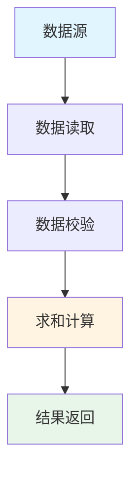
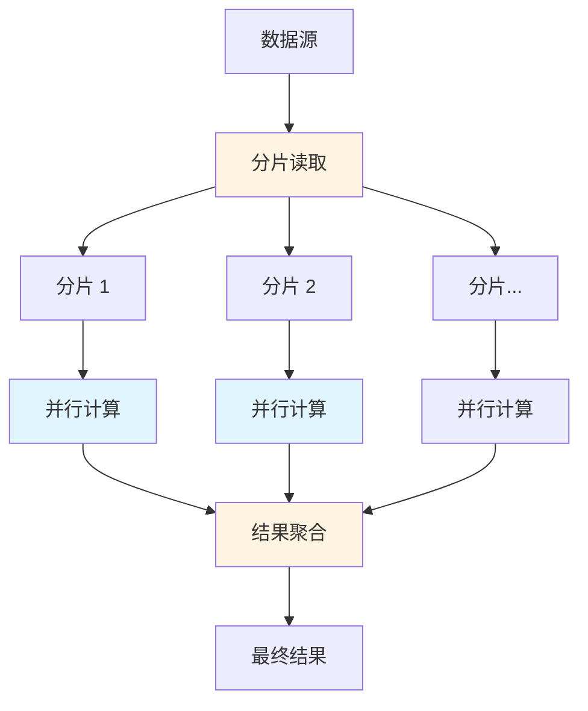
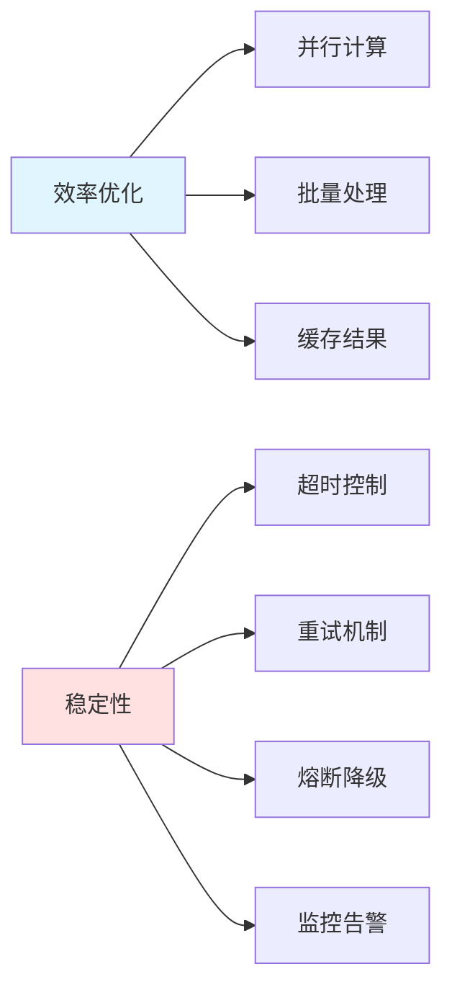

# 📊 数据求和系统设计

> 经典面试题：如何设计一个系统，计算一千条数据的和？如果是一百万条呢？如何保证计算效率和稳定性？

---

## 🎯 题目描述

**面试官问：** 如何设计一个系统，计算一千条数据的和？如果数据量是一百万条呢？如何保证计算的效率和稳定性？

**考察点：**
- 分层设计思维
- 性能优化意识
- 扩展性考虑
- 稳定性保障

---

## ✅ 方案一：一千条数据（基础方案）

### 架构图



### 核心设计

| 维度 | 方案 |
|------|------|
| **处理方式** | 同步单线程 |
| **加载策略** | 全部加载到内存 |
| **异常处理** | 校验数据格式，处理空值/异常值 |
| **日志记录** | 记录处理开始/结束时间、数据量 |

### 代码示例

```java
public long sumData(List<Long> dataList) {
    if (dataList == null || dataList.isEmpty()) {
        throw new IllegalArgumentException("数据不能为空");
    }
    
    long startTime = System.currentTimeMillis();
    
    long sum = dataList.stream()
        .filter(Objects::nonNull)  // 过滤空值
        .mapToLong(Long::longValue)
        .sum();
    
    long endTime = System.currentTimeMillis();
    log.info("处理完成，数据量：{}, 耗时：{}ms, 结果：{}", 
             dataList.size(), endTime - startTime, sum);
    
    return sum;
}
```

### 关键点

1. ✅ 数据量小，直接单线程处理
2. ✅ 全部加载到内存，不需要分批
3. ✅ 注意异常处理（空值、格式错误）
4. ✅ 记录日志便于排查问题

---

## 🚀 方案二：百万级数据（扩展方案）

### 架构图



### 核心策略

| 维度 | 方案 |
|------|------|
| **分批处理** | 每批 1000-5000 条，避免 OOM |
| **并行计算** | 使用线程池/Fork-Join |
| **流式处理** | 不一次性加载全部数据 |
| **中间结果** | 每批计算部分和，最后聚合 |

### 代码示例

#### 方式 1：并行流

```java
public long sumLargeData(Stream<Long> dataStream) {
    return dataStream
        .parallel()  // 并行流
        .filter(Objects::nonNull)
        .mapToLong(Long::longValue)
        .sum();
}
```

#### 方式 2：线程池 + 分片

```java
public long sumWithThreadPool(List<Long> data, int threadCount) throws Exception {
    ExecutorService executor = Executors.newFixedThreadPool(threadCount);
    
    // 分片
    int partitionSize = (int) Math.ceil((double) data.size() / threadCount);
    List<List<Long>> partitions = partitionList(data, partitionSize);
    
    // 提交任务
    List<Future<Long>> futures = partitions.stream()
        .map(partition -> executor.submit(() -> sumPartition(partition)))
        .collect(Collectors.toList());
    
    // 聚合结果
    long totalSum = 0;
    for (Future<Long> future : futures) {
        totalSum += future.get();  // 等待结果
    }
    
    executor.shutdown();
    return totalSum;
}

private List<Long> sumPartition(List<Long> partition) {
    return partition.stream()
        .filter(Objects::nonNull)
        .mapToLong(Long::longValue)
        .sum();
}
```

#### 方式 3：Fork-Join 框架

```java
public class SumTask extends RecursiveTask<Long> {
    private static final int THRESHOLD = 1000;
    private final List<Long> data;
    
    public SumTask(List<Long> data) {
        this.data = data;
    }
    
    @Override
    protected Long compute() {
        if (data.size() <= THRESHOLD) {
            return data.stream()
                .filter(Objects::nonNull)
                .mapToLong(Long::longValue)
                .sum();
        }
        
        int mid = data.size() / 2;
        SumTask left = new SumTask(data.subList(0, mid));
        SumTask right = new SumTask(data.subList(mid, data.size()));
        
        left.fork();
        long rightResult = right.compute();
        long leftResult = left.join();
        
        return leftResult + rightResult;
    }
}

// 使用
ForkJoinPool pool = new ForkJoinPool();
long sum = pool.invoke(new SumTask(data));
```

---

## 🛡️ 方案三：保证效率和稳定性

### 架构图



### 关键措施

| 维度 | 方案 | 说明 |
|------|------|------|
| **效率** | 并行计算 | 利用多核 CPU |
| **效率** | 批量处理 | 减少 IO 次数 |
| **效率** | 缓存结果 | 相同输入直接返回 |
| **稳定性** | 超时控制 | 防止长时间阻塞 |
| **稳定性** | 重试机制 | 处理临时故障 |
| **稳定性** | 熔断降级 | 保护系统不被拖垮 |
| **监控** | 处理时长 | 监控 P99 延迟 |
| **监控** | 成功率 | 监控失败率 |
| **监控** | 资源使用率 | CPU、内存、IO |

### 超时 + 重试示例

```java
@Service
public class SumService {
    
    @Retryable(
        maxAttempts = 3, 
        backoff = @Backoff(delay = 1000, multiplier = 2)
    )
    @Timeout(value = 30, unit = TimeUnit.SECONDS)
    @CircuitBreaker(name = "sumService", fallbackMethod = "sumFallback")
    public long sumWithRetry(List<Long> data) {
        return sumData(data);
    }
    
    // 降级方案
    public long sumFallback(List<Long> data, Exception ex) {
        log.error("求和失败，使用降级方案", ex);
        // 可以返回缓存结果、默认值或抛出友好异常
        throw new BusinessException("系统繁忙，请稍后重试");
    }
}
```

### 监控指标

```java
@Component
public class SumMetrics {
    
    private final MeterRegistry meterRegistry;
    
    public SumMetrics(MeterRegistry meterRegistry) {
        this.meterRegistry = meterRegistry;
    }
    
    public long sumWithMetrics(List<Long> data) {
        Timer.Sample sample = Timer.start(meterRegistry);
        Counter.builder("sum.request.total")
               .description("求和请求总数")
               .register(meterRegistry)
               .increment();
        
        try {
            long result = sumData(data);
            
            Counter.builder("sum.request.success")
                   .description("求和成功数")
                   .register(meterRegistry)
                   .increment();
            
            return result;
        } catch (Exception e) {
            Counter.builder("sum.request.failure")
                   .description("求和失败数")
                   .register(meterRegistry)
                   .increment();
            throw e;
        } finally {
            sample.stop(Timer.builder("sum.duration")
                              .description("求和耗时")
                              .register(meterRegistry));
        }
    }
}
```

---

## 📈 方案对比

| 数据规模 | 处理策略 | 关键点 | 适用场景 |
|----------|----------|--------|----------|
| **千级** | 同步单线程 | 简单直接，注重代码质量 | 配置数据、小批量计算 |
| **万级** | 并行流 | 利用多核，代码简洁 | 中等规模数据处理 |
| **百万级** | 线程池分片 | 分批、并行、聚合 | 大数据量计算 |
| **千万级+** | 分布式计算 | Spark/Flink 等大数据框架 | 海量数据处理 |

---

## 💡 回答技巧

### 面试时的回答框架

```
1. 确认需求（数据量、延迟要求、准确性要求）
   ↓
2. 基础方案（千级数据，简单直接）
   ↓
3. 扩展方案（百万级，分片 + 并行）
   ↓
4. 稳定性保障（超时、重试、熔断、监控）
   ↓
5. 总结（根据场景选择合适方案）
```

### 加分项

- ✅ 主动问清楚数据规模、延迟要求
- ✅ 提到内存限制和 OOM 风险
- ✅ 考虑异常情况和容错机制
- ✅ 提到监控和日志
- ✅ 能说出不同方案的适用场景

### 避免的坑

- ❌ 一上来就说分布式（过度设计）
- ❌ 不考虑异常处理
- ❌ 忽略性能监控
- ❌ 只说思路，写不出代码

---

## 🎓 总结

**核心原则：**

1. **先保证正确性，再优化性能**
2. **根据数据量选择合适方案，不要过度设计**
3. **监控和告警不能少阿鲁！**
4. **分层设计思维：接入层→处理层→数据层**

**这道题考察的是：**

- 分层设计思维
- 扩展性意识
- 性能优化能力
- 稳定性保障意识

---

## 📚 相关知识点

- [限流算法](../backend-basics/限流算法.md)
- [布隆过滤器](../backend-basics/布隆过滤器.md)
- [分布式系统](../distributed-system/README.md)
- [数据库索引](../database/README.md)

---

> 💬 **神乐点评：** 这道题是经典的分层设计题，回答时要把思路讲清楚！先从小数据量说起，再逐步扩展到大数据量，最后讲稳定性保障。记住：不要一上来就分布式，那是过度设计阿鲁！🌂
